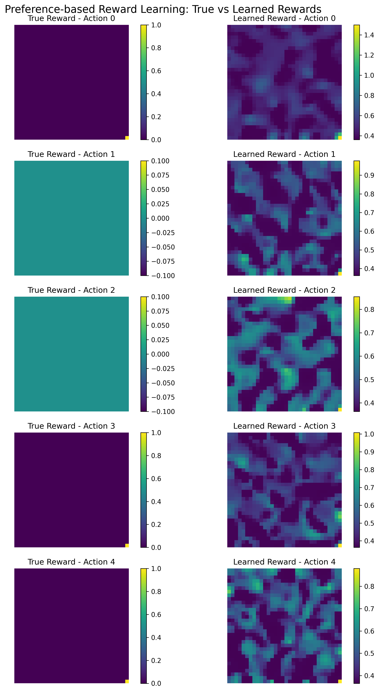
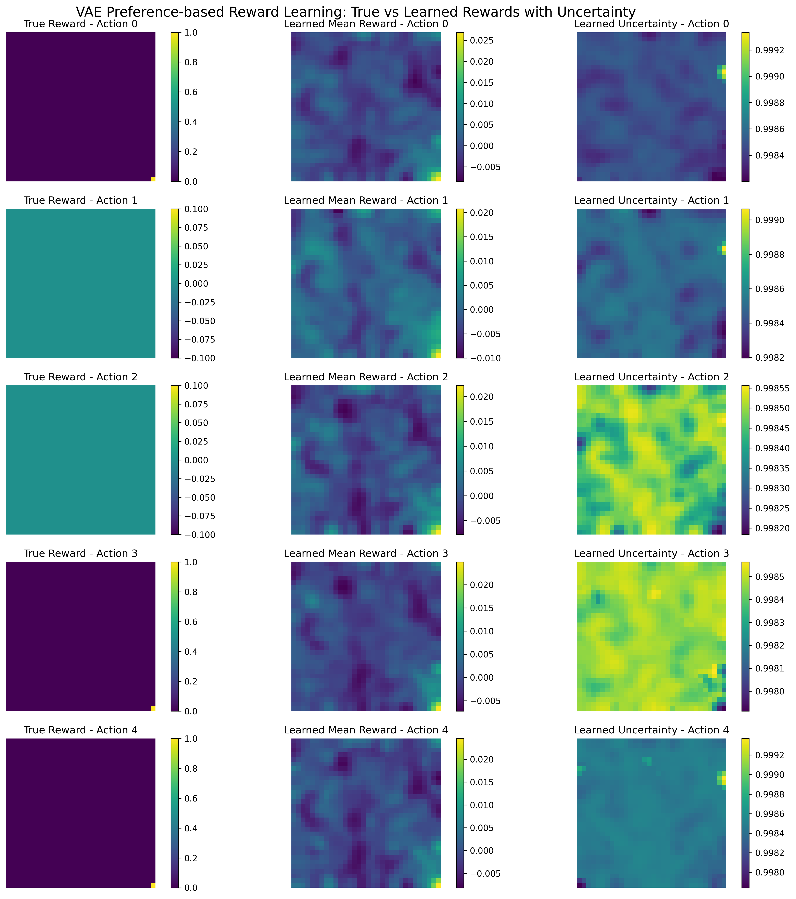
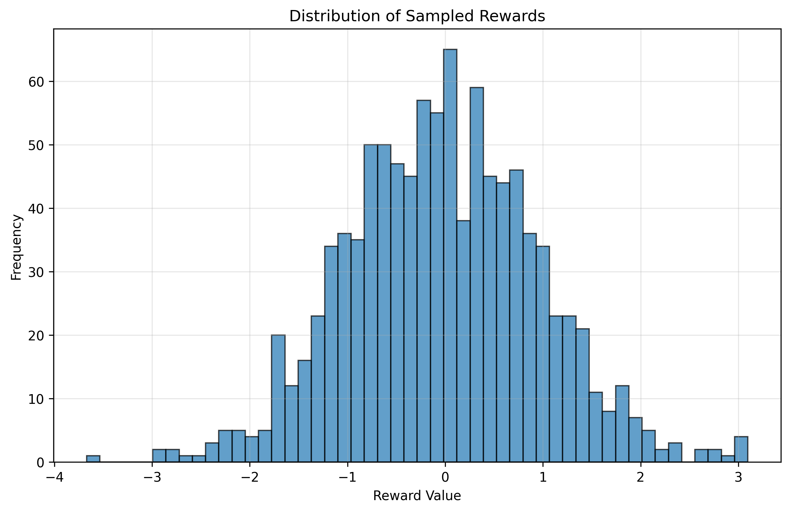

# Reward Learning Comparison: IID vs Preference-based vs VAE Approaches

This project compares three different approaches to reward learning in a grid-world Markov Decision Process (MDP) environment. The goal is to learn the underlying reward function from different types of data: direct state-action-reward pairs, preference data, and preference data with uncertainty estimation.

## Environment Setting

### Grid World MDP

The environment is a 2D grid world defined in `grid_env.py` with the following characteristics:

- **Grid Size**: 16×16 for IID experiments, 32×32 for preference experiments
- **Actions**: 5 discrete actions (RIGHT, UP, LEFT, DOWN, STAY)
- **States**: Each grid cell represents a state (256 states for 16×16, 1024 states for 32×32)
- **State Features**: DCT (Discrete Cosine Transform) basis functions computed on the grid
- **Transitions**: Deterministic with optional random transitions (p_rand=0.0 in our experiments)

### Reward Functions

The environment supports multiple reward function types:
- **Sparse**: +1 reward only for staying in the goal state (bottom-right corner), 0 otherwise
- **Dense**: Shaped reward function with gradients toward the goal
- **Path**: Path-following reward with punishing edges
- **Cliff**: Similar to path but with asymmetric edge penalties

**For this study, we focus on the sparse reward function**, which provides a challenging learning scenario with minimal reward signal.

### DCT State Features

State features are computed using 2D DCT-II basis functions:
- **Basis Functions**: 8×8 = 64 DCT basis functions
- **Feature Vector**: Each state is represented by a 64-dimensional feature vector
- **Input Dimension**: 64 (DCT features) + 5 (one-hot action encoding) = 69 dimensions

## Experimental Setup

### Shared Hyperparameters

All experiments use consistent hyperparameters for fair comparison:

- **Hidden Dimensions**: [64, 32]
- **Batch Size**: 128
- **Number of Epochs**: 300
- **Learning Rate**: 0.001
- **Optimizer**: Adam
- **Dataset Size**: 3000 samples (for preference-based approaches)

### Model Architectures

1. **IID Model**: Simple MLP with MSE loss for direct regression
2. **Preference Model**: MLP with reward encoder + preference prediction using BCE loss
3. **VAE Model**: Probabilistic reward encoder with ELBO objective

## Results

### 1. IID Reward Learning (`main_mlp_iid.py`)

**Approach**: Direct regression from state-action-reward pairs
- **Dataset**: 1280 state-action pairs with ground truth rewards
- **Loss**: Mean Squared Error (MSE)
- **Final Loss**: 0.000035


**Results**: The IID approach achieves excellent reconstruction quality with very low MSE loss. The learned rewards closely match the ground truth sparse reward function, successfully identifying the goal state (bottom-right corner) where the reward is +1.

**Strengths**:
- Direct supervision with ground truth rewards
- Simple and effective for this setting
- Very low reconstruction error

**Limitations**:
- Requires direct access to reward values
- Not applicable in real-world preference learning scenarios

### 2. Preference-based Reward Learning (`main_mlp_preference.py`)

**Approach**: Learning from trajectory preferences using MLE
- **Dataset**: 3000 trajectory pairs with binary preferences
- **Loss**: Binary Cross Entropy (BCE)
- **Final Loss**: 0.597930
- **Accuracy**: 68.47%



**Results**: The preference-based approach successfully learns the reward structure from trajectory comparisons. While the reconstruction is less precise than IID learning, it correctly identifies the goal region and learns a reasonable approximation of the sparse reward function. At the same time, we can observe that rewards vary more erratically compared to the IID and VAE approaches, hinting at overfitting.

**Strengths**:
- Works with human-like preference data
- No need for direct reward access
- Reasonable reconstruction quality

**Limitations**:
- Lower accuracy compared to IID learning
- Requires trajectory-level comparisons
- No uncertainty quantification

### 3. VAE Preference-based Reward Learning (`main_vae_preference.py`)

**Approach**: Probabilistic reward learning with uncertainty estimation
- **Dataset**: 3000 trajectory pairs with binary preferences
- **Loss**: ELBO (Evidence Lower BOund) with β=0.1
- **Final Loss**: 5.955388 (ELBO)
- **Accuracy**: 50.50%



**Results**: The VAE approach provides both reward estimates and uncertainty quantification. While the preference prediction accuracy is lower, the model provides valuable uncertainty information about its predictions. We can observe more regular (smoother) rewards compared to the IID and preference-based approaches.

#### Uncertainty Analysis




**Strengths**:
- Provides uncertainty estimates
- Probabilistic framework
- Can identify regions of high uncertainty

**Limitations**:
- Lower preference prediction accuracy
- More complex training
- Requires careful tuning of β parameter

## Comparison Summary

| Approach | Final Loss | Accuracy | Uncertainty | Data Requirements |
|----------|------------|----------|-------------|-------------------|
| IID | 0.000035 | N/A | No | Direct rewards |
| Preference | 0.597930 | 68.47% | No | Trajectory preferences |
| VAE | 5.955388 | 50.50% | Yes | Trajectory preferences |

### Key Insights

1. **IID Learning**: Achieves the best reconstruction quality but requires direct access to reward values, which is often unavailable in real-world scenarios.

2. **Preference Learning**: Provides a reasonable approximation of the reward function using only trajectory preferences, making it more practical for human-in-the-loop learning.

3. **VAE Approach**: Offers uncertainty quantification at the cost of reduced accuracy, which can be valuable for identifying regions where the model is uncertain about its predictions.

### Practical Considerations

- **Data Efficiency**: IID learning requires the least data but the most informative supervision
- **Human Feedback**: Preference learning aligns with how humans naturally provide feedback
- **Robustness**: VAE approach provides uncertainty estimates that can guide exploration and data collection

## Code Structure

- `grid_env.py`: Environment definition and reward functions
- `model.py`: Standard MLP models for IID and preference learning
- `model_vae.py`: VAE-based probabilistic reward model
- `data.py`: Dataset classes for IID and preference data
- `main_mlp_iid.py`: IID reward learning experiment
- `main_mlp_preference.py`: Preference-based reward learning experiment
- `main_vae_preference.py`: VAE preference-based reward learning experiment

## Running the Experiments

```bash
# IID reward learning
python main_mlp_iid.py

# Preference-based reward learning
python main_mlp_preference.py

# VAE preference-based reward learning
python main_vae_preference.py
```

All experiments will automatically save figures to the `figures/` directory.

## Dependencies

- PyTorch
- NumPy
- Matplotlib
- NetworkX (for environment visualization)

This study demonstrates the trade-offs between different reward learning approaches and provides insights into when each method might be most appropriate for real-world applications. 